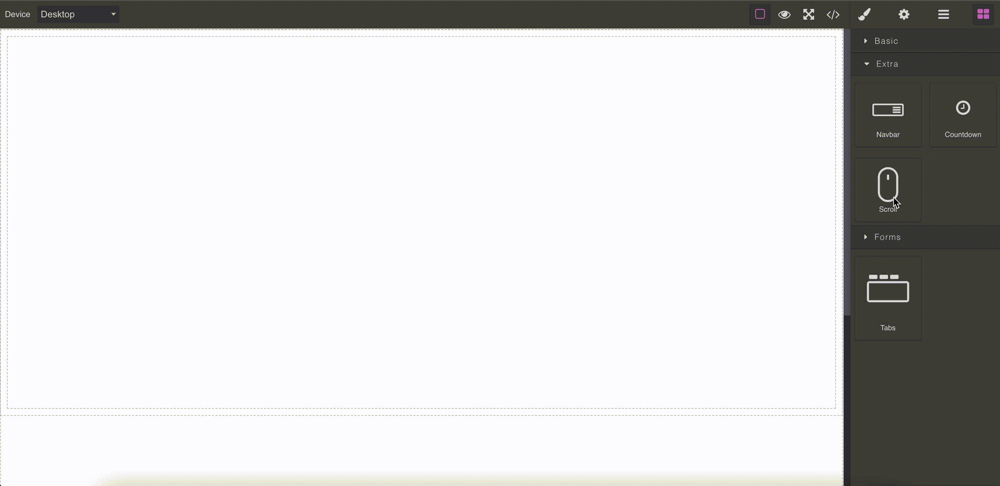
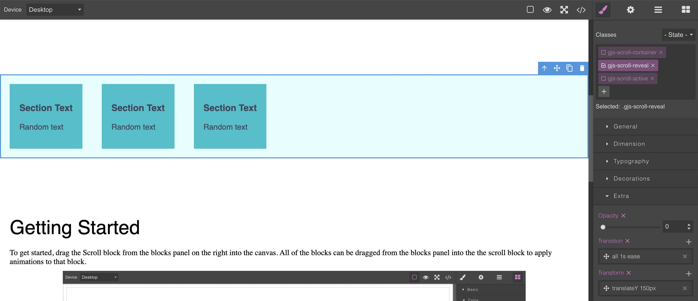

# GrapesJS Scroll Animation

Scroll animations component for GrapesJs

<p align="center"></p>


[Demo](https://grapesjs-plugin-scroll-demo.gradyserver.com/)


## Requirements
* GrapesJS v0.13.8 or higher


## Summary

* Plugin name: `grapesjs-plugin-scroll`
* Components
  * `Scroll` - Div component which triggers the animations
  * `Scroll-content` - Default content that's rendered by the scroll animation
* Blocks
  * `Scroll`


## Options

| Option          | Description                      | Example                                                                                         |
| --------------- | -------------------------------- | ----------------------------------------------------------------------------------------------- |
| `content`        | A function returning the html content of the Scroll-content component as a string              | ``(prefix, componentType) => `<h3 data-gjs-type="${componentType}" class="${prefix}-h3">Section Text</h3>` ``
| `innerStyles`        | A function returning the css styles of the Scroll-content component as a string              | ``(prefix) => `.${prefix}-container h1{ font-size: 3rem;}` ``
| `prefix`        | The string that preceds every class              | `gjs-scroll` (default)
| `styles`        | A function returning the html content of the Scroll-content component as a string              | ``(prefix) =>  `.${prefix}-container { min-height: 100vh; }``
| `blockName`        | The name of the block as it appears in the block manager              | `Scroll` (default)


## Download

<!-- * NPM
  * `npm i grapesjs-plugin-scroll` -->
* GIT
  * `git clone https://github.com/benjgrad/grapesjs-plugin-scroll.git`


## Integration

Directly in the browser

```html
<link href="https://unpkg.com/grapesjs/dist/css/grapes.min.css" rel="stylesheet"/>
<script src="https://unpkg.com/grapesjs"></script>
<script src="https://unpkg.com/grapesjs-plugin-scroll"></script>

<div id="gjs"></div>

<script type="text/javascript">
  var editor = grapesjs.init({
      container : '#gjs',
      ...
      plugins: ['grapesjs-plugin-scroll'],
      pluginsOpts: {
        'grapesjs-plugin-scroll': 
        { 
          // options
        }
      }
  });

</script>

```

Modern javascript

```js
import grapesjs from 'grapesjs';
import gjsScroll from 'grapesjs-plugin-scroll';

const editor = grapesjs.init({
  container : '#gjs',
  // ...
  plugins: [gjsFogjsScrollrms],
  pluginsOpts: {
    [gjsScroll]: { /* options */ }
  }
  // or
  plugins: [
    editor => gjsScroll(editor, { /* options */ }),
  ],
});
```


## Development

Clone the repository

```sh
$ git clone https://github.com/benjgrad/grapesjs-plugin-scroll.git
$ cd grapesjs-plugins-scroll
```

Install dependencies

```sh
$ npm i
```

Start the development server

```sh
$ npm start
```
## Usage 

The animations trigger when the style class `gjs-scroll-active` is added to the html element, which happens when the user scrolls past a threshold. This means that if you want to edit the animation, you will need to edit the transition or transform with the class selected. The style class `gjs-scroll-reveal` alternatively, will be used when the user scrolls up. In the example above, the opacity is set to 0 and the element is moved down by the styles of `gjs-scroll-reveal` until the user scrolls past the threshold. Once the user scrolls past the threshold, the styles of `gjs-scroll-active` will set the opacity to 1 (so it can be seen) and move the element up.

<p align="center"></p>

To edit animations that will apply before the user hits the scroll threshold, select the class `gjs-scroll-reveal` in the style manager. You can then edit any of the attributes in the style manager, including the animation, which can be found under  Extra.

To edit animations that will apply  after  the user reaches the scroll threshold, select the class `gjs-scroll-active` in the style manager. These style changes will only apply as long as the user has passed the scroll threshold. If they scroll up, the element will be reset and the changes will take place again once the user scrolls down. 

## License

MIT
